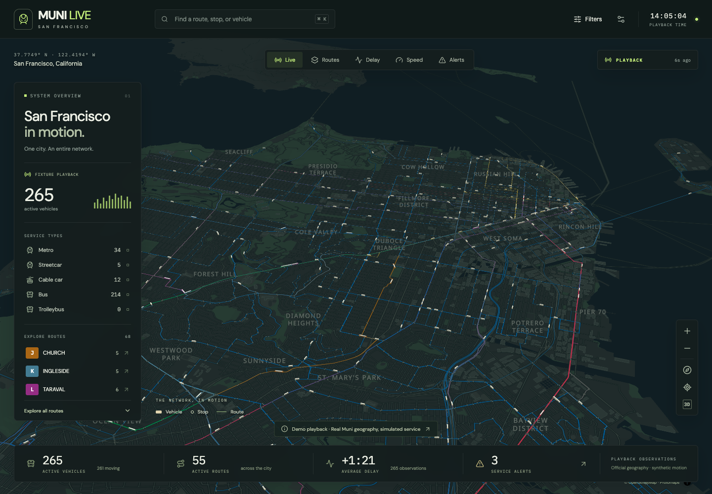
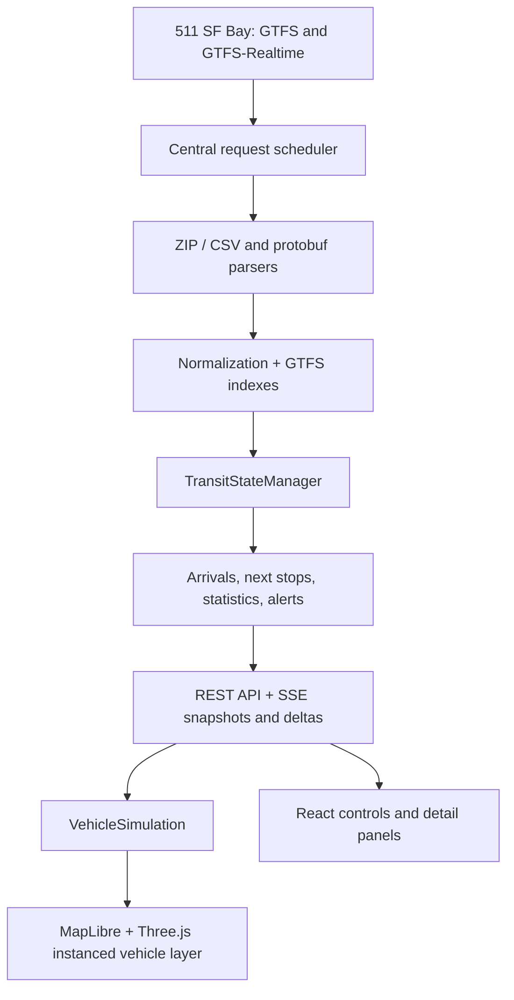

# Muni Live

A spatial command center for San Francisco's Muni network: real geographic routes, an interactive 3D city, smoothly moving vehicles, stop departure boards, route focus, and network health.

**Live application:** [sf-muni.vercel.app](https://sf-muni.vercel.app) · [Backend health](https://sf-muni-api.tempserver.click/api/health)

Official 511 GTFS and all three realtime feeds are running on the development VPS behind Traefik, with the frontend on Vercel. Public browser checks verified vehicle updates, selection, realtime arrivals, and server-only credentials. New local installations without a token use explicitly labeled fixture playback. See the [verification record](docs/verification.md).



## Run locally

Requires Node.js 22.12+ and npm. From this directory:

```sh
npm install
npm run dev
```

Open **http://127.0.0.1:5173**. The API listens on port 3001. On first startup the server copies the included San Francisco map assets into `data/`, imports the GTFS fixture, and starts deterministic playback. No map-provider account, database, Docker, or live token is needed for this mode.

The included fixture imports **68 routes, 3,240 stops, 34,668 trips, and 287 shapes**. Its first playback frame contains 270 synthetic vehicles. Counts change as trips enter and leave service. These are development observations, not current Muni system statistics.

## Enable official live data

Request a token through [511 Open Data](https://511.org/open-data/transit). Create a `.env` file in the project root using `.env.example`, then configure:

```dotenv
511_API_KEY=your-server-only-token
511_OPERATOR_ID=SF
TRANSIT_DATA_SOURCE=live
```

Restart `npm run dev`. The backend downloads the active SF GTFS archive from 511 and starts all three realtime feeds. Follow `/api/health` and the structured server logs. A failed live connection does **not** switch silently to synthetic playback.

The token is used exclusively in server requests. It is never a `VITE_*` variable, client property, response field, or logged upstream URL. Do not put it in a shared URL, screenshot, or chat message. `.env` and the server's `data/` cache are ignored.

## Deploy with Vercel and the development VPS

Use [the deployment guide and Compose service](deploy/development/sf-muni/README.md).
It matches `projects-devops/development/`: Traefik `websecure`, certificate resolver
`myresolver`, and external network `development-network`. The default backend is
`sf-muni-api.tempserver.click`; change `API_DOMAIN` to choose a different prefix.

The frontend keeps Vercel's default `<project>.vercel.app` address. Set
`VITE_API_ORIGIN` on Vercel to the backend's HTTPS origin, and set `CORS_ORIGINS`
on the VPS to the exact Vercel URL. The browser connects directly to the backend
for REST, SSE, map tiles, and fonts. Only the VPS receives the 511 token.

`Dockerfile` builds the backend, `.github/workflows/backend-image.yml` publishes
it to GHCR, and `vercel.json` builds only `dist/client`. Run one backend with its
persistent data volume; no cron jobs or database are required.

The deployed frontend is `https://sf-muni.vercel.app` and its API origin is
`https://sf-muni-api.tempserver.click`. Pushes to `main` automatically deploy the
frontend. Backend changes publish an image to GHCR; update `MUNI_IMAGE` in the
VPS service's `.env`, then run `docker compose pull` and `docker compose up -d`
from `/root/projects-devops/development/sf-muni` to deploy that image. The currently
verified backend image is `ghcr.io/srdjanrist/sf-muni-api:sha-b981c27`.

## Architecture



- **Server:** Fastify, strict TypeScript, versioned disk caches, one polling owner. No database or Redis.
- **Transit:** shared normalized interfaces, trip/service-instance identity, Los Angeles calendars, indexed stop times and full shape geometry.
- **Client:** React/Vite, Zustand for UI state, TanStack Query for detail requests. Animation lives outside React.
- **Geography:** MapLibre renders a local PMTiles vector basemap and route/stop layers. Three.js shares its WebGL camera/context. The city is not a screenshot texture.

See [architecture and operational details](docs/architecture.md).

## Explore the network

- Select a route from the left panel or click its line to focus the network.
- Click a vehicle to see its trip, destination, next stop, prediction, schedule deviation, telemetry, and stop timeline. Follow mode tracks the moving vehicle; drag the map or press Escape to exit.
- Click a stop or find one with search to view departures. Scheduled and realtime observations are labeled separately.
- Search route names/numbers, stop names/IDs, and vehicle IDs. `⌘K`/`Ctrl+K` focuses search.
- Use Live, Routes, Delay, Speed, and Alerts views. Filters cover route, service type, direction, vehicle status, delay, and alert association.
- Preferences control buildings, routes, stops, labels, statistics, and reduced graphics. Lower-powered/mobile devices start with reduced detail.
- Selections and visualization modes are shareable, such as `/?route=N`, `/?vehicle=SIM-1000`, or `/?mode=delay`. Use the actual feed's string IDs.

## Record a showcase video

Open **Showcase** in the top toolbar and choose **Start 60-second burst**. The
shared backend polls vehicle positions about every 20 seconds for one minute,
then returns to its normal cadence. Select a vehicle and press **Follow** to
frame the recording. **Stop burst** ends it early.

The button requires healthy live feeds and at least four remaining requests in
the configured hourly budget. Bursts have a shared one-hour cooldown persisted
on the VPS, cannot be extended by repeated clicks, and end early under budget
pressure or upstream failure. Arrival and alert polling stay unchanged. Motion
between observations remains estimated; faster polling cannot force 511 to
supply a new GPS observation. Fixture playback does not consume live burst quota.

## Polling and rate limits

The standard 511 token allowance is **60 requests per rolling 3,600 seconds**, shared across endpoints. The defaults reserve some room for static downloads and retries:

| Feed              | Default interval | Routine requests/hour |
| ----------------- | ---------------: | --------------------: |
| Vehicle positions |      120 seconds |                    30 |
| Trip updates      |      180 seconds |                    20 |
| Service alerts    |      600 seconds |                     6 |
| Static GTFS       |         24 hours |           About 1/day |

A persisted rolling budget and interprocess lock also cover maintenance commands. Requests that would exceed the budget wait. HTTP 429 pauses all feeds, respects `Retry-After`, and leaves last-known state visible. Other failures back off with jitter. Request timeout applies to body consumption as well as headers; payload sizes are bounded.

Use a dedicated token for this application: the scheduler cannot observe requests made by unrelated programs using the same token. Run **one ingestion server per token/cache**. Multiple independent server replicas would require an external shared scheduler.

Increase polling frequency only after increasing `API_REQUESTS_PER_HOUR` to your confirmed 511 allowance. Faster browsers never increase upstream polling.

## Configuration

| Variable                         | Default     | Purpose                                                             |
| -------------------------------- | ----------- | ------------------------------------------------------------------- |
| `511_API_KEY`                    | empty       | Server-only 511 token                                               |
| `511_OPERATOR_ID`                | `SF`        | Static operator and realtime agency                                 |
| `TRANSIT_DATA_SOURCE`            | `auto`      | `auto`, `live`, or `fixture`; auto uses live only when a key exists |
| `FIXTURE_SCENARIO`               | `synthetic` | Deterministic simulation or a locally `recorded` observation        |
| `GTFS_REFRESH_INTERVAL_MS`       | `86400000`  | Static refresh interval                                             |
| `VEHICLE_POLL_INTERVAL_MS`       | `120000`    | Vehicle polling interval                                            |
| `TRIP_UPDATE_POLL_INTERVAL_MS`   | `180000`    | Trip-update polling interval                                        |
| `SERVICE_ALERT_POLL_INTERVAL_MS` | `600000`    | Alert polling interval                                              |
| `API_REQUESTS_PER_HOUR`          | `60`        | Shared rolling request cap                                          |
| `UPSTREAM_TIMEOUT_MS`            | `30000`     | HTTP request/body timeout                                           |
| `STATIC_DOWNLOAD_TIMEOUT_MS`     | `120000`    | Longer timeout for downloading the static GTFS ZIP                  |
| `VEHICLE_STALE_AFTER_MS`         | `180000`    | Observation age before stale presentation                           |
| `VEHICLE_REMOVE_AFTER_MS`        | `600000`    | Successful-feed omission TTL; also needs three missing cycles       |
| `PORT`                           | `3001`      | Backend port; update Vite proxy when changing it                    |
| `LOG_LEVEL`                      | `info`      | Structured log verbosity                                            |
| `VITE_TRANSIT_DEBUG`             | `false`     | Client renderer/debug counters; contains no credentials             |

## Commands and tests

```sh
npm run typecheck
npm run lint
npm test
npx playwright install chromium
npm run test:e2e
npm run build
npm run start
```

`npm run test:production` checks a separately running compiled server at port 3002 (override with `PRODUCTION_TEST_URL`). This specifically catches worker/asset packaging errors that a Vite preview can hide. Run browser tests in fixture mode; the default suite intentionally requires clearly labeled synthetic playback.

The combined local production server serves the compiled application at **http://127.0.0.1:3001**. Run from the repository root so the server can locate `fixtures/` and `data/`. The public deployment instead serves the frontend from Vercel and runs the API behind Traefik with a persistent `data/` volume.

Verify the public deployment without starting another ingestion process:

```sh
LIVE_TEST_URL=https://sf-muni.vercel.app \
LIVE_API_URL=https://sf-muni-api.tempserver.click npm run test:live
```

Maintenance:

```sh
npm run gtfs:download
npm run gtfs:parse -- data/gtfs.zip
npm run map:prepare
npm run transit:record-fixture
```

The recording command consumes three budgeted requests and writes protobuf files, a matching cached static snapshot, and a timestamp manifest to `fixtures/recorded/`. Set `TRANSIT_DATA_SOURCE=fixture` and `FIXTURE_SCENARIO=recorded` to inspect it. A single historical frame does not invent later observations; extrapolation stops normally and the data becomes stale.

Tests cover service-day/DST logic, calendar overrides, predictions, protobuf presence, shape matching, simulation, retention, rate limits, API contracts, actual GTFS import, browser selection, search/filtering, mobile layout, disconnect recovery, and rendering load. Browser screenshots and traces appear under `test-results/` and `playwright-report/`.

## Motion and truthfulness

Each vehicle keeps its network observation separate from its displayed state. New GPS points are projected onto the associated full-resolution GTFS shape when the match is plausible. Animation follows cumulative shape distance, preserving corners and using smooth heading changes. Unmatched observations use projected raw GPS instead.

Displayed motion is an estimate between sparse observations. Interpolation can deliberately lag by up to the polling interval. Extrapolation tapers after 30 seconds and stops at 90 seconds; stopped vehicles remain at their reported location. The UI always retains the actual source age. A smooth scene is not evidence of a freshly observed position.

Delay statistics exclude unknown values and show sample counts. Zero speed does not automatically mean a bus is at a stop. No ridership, occupancy, exact fleet model, or train-car counts are invented.

## Data sources and limitations

- Live transit: [511 SF Bay](https://511.org/open-data/transit), operator/agency `SF`.
- Bundled static fixture: [SFMTA's official DataSF GTFS archive](https://data.sfgov.org/d/dni7-qpv3), retrieved September 8, 2026; see [fixture provenance](fixtures/README.md).
- Basemap: [Protomaps](https://protomaps.com/), OpenStreetMap, and Natural Earth; see [map provenance](fixtures/map/README.md). Map heights may be representative where source heights are absent.

**Live verification:** On September 10, 2026, the configured server successfully imported 511 GTFS and decoded all three realtime feeds. Chromium checks verified live vehicle rendering, selection, stop predictions, changing positions with stable IDs, and absence of the token from browser requests/client assets. Reproduce with `npm run test:live` while the live app is running. See [verification](docs/verification.md) for counts and limits. Many overnight VehiclePositions records omit trip/route descriptors; those vehicles remain visible with unknown route/type.

Other deliberate limits: terrain and tunnel cutaways are not enabled; shapes through underground segments are shown as network overlays. Historical replay storage, heatmaps, weather, traffic, occupancy, and precise vehicle assets are deferred. Trolleybuses are distinguished only when route type metadata supports it. Non-exact frequency service does not produce fabricated fixed scheduled departure instants. Complex replacement/duplicated trip descriptors need further feed-specific coverage. Performance on integrated/low-power hardware still needs measurement.
