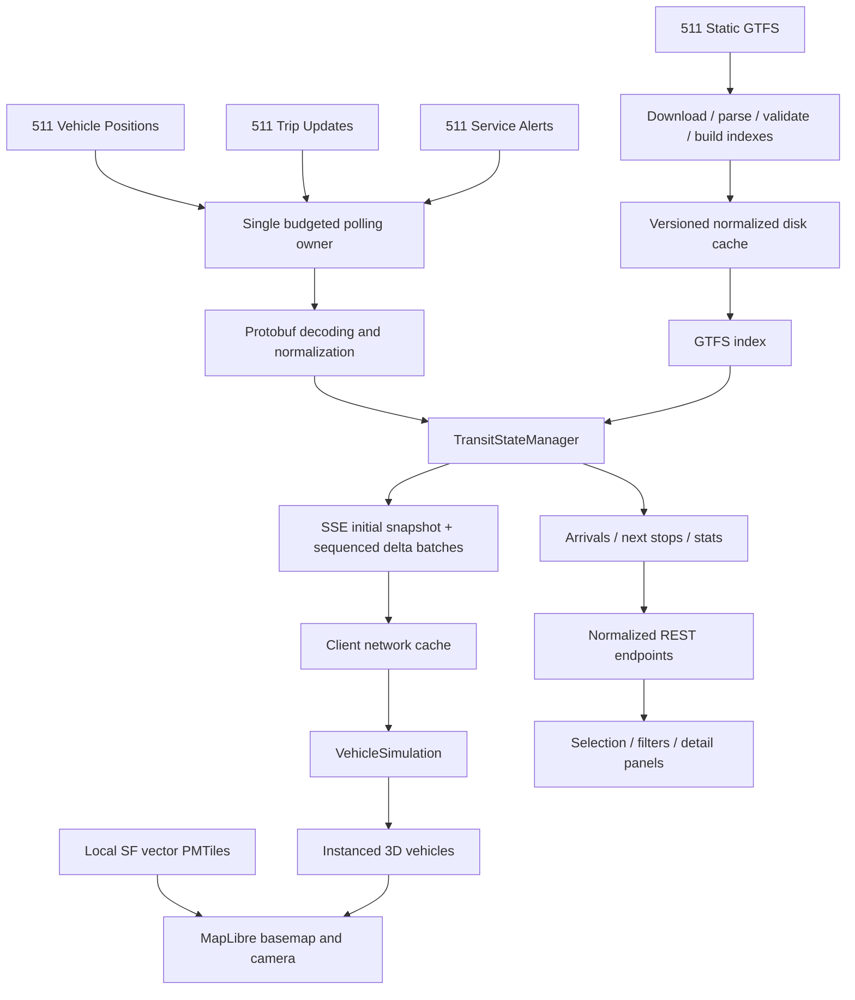

# Architecture and operations

## Boundaries

`src/server/upstream` owns credential-bearing requests, timeouts, the rolling budget, and upstream error sanitization. `gtfs` owns downloads, streaming CSV parsing, immutable snapshots, map asset initialization, and indexes. `realtime` decodes/normalizes protobuf, combines full and differential feeds, and schedules polling. `transit` owns vehicle retention, next stops, predictions, alerts, and statistics. `api` exposes normalized public contracts.

The browser imports only `src/shared` and `src/client`. `VehicleSimulation` owns projected positions, shape progress, heading, interpolation, and bounded extrapolation. React does not receive animation-frame position updates. MapLibre owns the geographic camera and tiled basemap; `VehicleLayer` writes shared Three.js instance matrices during map rendering. Picking uses an enlarged screen-space distance around projected moving vehicles, followed by MapLibre stop/route feature picking.

## Split hosting

Vercel serves the Vite production build. `VITE_API_ORIGIN` is a public build-time
backend origin used by REST, EventSource, PMTiles, and glyph requests. The VPS
runs the Docker image continuously behind existing development Traefik, with
`HOST=0.0.0.0`, `SERVE_FRONTEND=false`, and a persistent `DATA_DIR=/app/data`.
The named volume holds static data, realtime checkpoints, and the request budget.
The API container publishes no host port; Traefik routes its internal port 3001.

`CORS_ORIGINS` lists exact frontend origins. The CORS plugin covers APIs, range
responses, and fonts. Because the SSE handler hijacks Fastify's response, it
explicitly copies pending CORS headers into the raw response before streaming.
Traefik streams event responses immediately; buffering middleware must not be
attached. The frontend remains independent of Vercel Functions and Cron Jobs.

The [deployment guide](../deploy/development/sf-muni/README.md) includes GHCR
publishing, DNS, configuration, verification, and rollback commands.

## Static import

The importer reads only recognized ZIP entries and streams CSV records. It handles UTF-8 BOMs, orders stops/shape sequences, validates coordinate ranges and foreign keys, and tracks skipped malformed rows. Required missing tables or an unusable network fail the import. Either `calendar.txt` or `calendar_dates.txt` can supply service definitions. Optional pathways, levels, transfers, feed metadata, and direction metadata are retained server-side.

Indexes provide route→trips, trip→route/stop times/shape, stop→trips/routes, parent station→children, and shape→ordered points. Cumulative shape distances are independently calculated in meters because supplied GTFS distance units need not be meters. Overview geometry is simplified; simulation receives original shape detail on demand. Browser payloads omit raw trip/stop-time tables.

Refresh builds a complete new snapshot and index before replacing live state. A failed import keeps the old snapshot and reports an error. Cached normalized JSON accelerates live restarts. The complete static GTFS archive and its normalized representation stay on the server.

## Time and prediction semantics

All transit epochs use the agency timezone. GTFS seconds can exceed 86,400; service epochs use local noon minus 12 elapsed hours to handle DST according to GTFS. Arrival queries consider prior service days far enough back to cover the largest supplied time, plus the future query horizon. Calendar exceptions override weekday service.

Trips use the descriptor's trip ID, start date, and start time where supplied. Stop sequence takes precedence over stop ID when a route revisits the same stop. Absolute realtime events override delay fields; known delay propagates downstream until replaced or cleared by `NO_DATA`. Canceled trips and skipped stops are excluded from departure boards. Scheduled fallback retains unknown delay rather than asserting zero. Exact frequency service expands into instances; non-exact headways require realtime observations for fixed departure predictions.

Missing descriptor fields remain a source of uncertainty. A vehicle with valid coordinates remains visible even if its static trip does not match. Its unavailable fields are shown as unknown, with raw GPS as a rendering fallback.

## Transport and freshness

`GET /api/realtime/stream` emits `initial_snapshot`, then `transit_delta` batches with version, static version, timestamp, changed vehicles, removed IDs, trip-change indication, optional replaced alerts, stats, and health. Reconnect always sends a new coherent snapshot. Heartbeats run every 15 seconds. Slow-client queues are bounded to 2 MB and disconnected for snapshot recovery.

Source timestamps and receipt timestamps are distinct. Feed failures never clear vehicles. Successful omissions start an omission timer; one omission is retained, repeated omissions fade, and three missing cycles plus the configured TTL remove the vehicle. Source age independently marks vehicles stale. Statistics count fresh present observations and retain explicit sample counts. A 30-second disk checkpoint preserves last-known vehicle and alert state across live restarts.

## Projection and rendering

Coordinates are Web Mercator relative to `37.7749, -122.4194`, with latitude scaling into local meters. A single origin transform maps Three.js east/up/south axes into MapLibre's Mercator coordinates. Shape matching uses exact segment projection and a bounded prior-progress penalty to disambiguate overlapping segments. Matches over 85 meters from the expected shape fall back to raw coordinates.

Interpolation blends from the actual displayed position toward each new observation over the observed update interval, bounded to 3–120 seconds. Large jumps, implausible speed, and trip changes reset continuity. Shape-constrained extrapolation integrates a declining speed factor monotonically: full through 30 seconds, tapering through 90, then frozen. Heading uses shortest angular interpolation and rejects strongly contradictory bearings when observed movement is available.

Vehicles share body, roof, and window geometries per service category. Capacity expands by powers of two. Labels use MapLibre symbols instead of moving DOM nodes. Stops and buildings use zoom/detail limits. Settings provide a manual reduced mode, with mobile and low-core devices selecting it initially.

## API surface

| Endpoint                                         | Response                                                               |
| ------------------------------------------------ | ---------------------------------------------------------------------- |
| `/api/health`, `/api/system/status`              | Static readiness, feed health/freshness, budget, source                |
| `/api/network`                                   | Routes, stops, bounds, simplified network shapes, version/ETag         |
| `/api/routes`, `/api/routes/:id`                 | Route metadata; focused stats, stops, shapes, alerts                   |
| `/api/stops`, `/api/stops/:id`                   | Stop metadata, serving routes, alerts                                  |
| `/api/stops/:id/arrivals?horizon=60`             | Sorted upcoming departures/predictions; horizon 1–180 minutes          |
| `/api/vehicles`, `/api/vehicles/:id`             | Normalized observations; detail includes route, trip, timeline, alerts |
| `/api/shapes/:id`                                | Full-resolution shape for simulation, cached on demand                 |
| `/api/alerts`, `/api/stats`                      | Current advisories and supported network aggregates                    |
| `/api/search?q=...`                              | Bounded route/stop/vehicle search results                              |
| `/api/realtime/snapshot`, `/api/realtime/stream` | Initial state and subsequent SSE deltas                                |

No endpoints return raw upstream responses or secrets. Map asset serving allowlists the PMTiles archive and validated font path segments; the cache directory is not publicly mounted.

## Operating constraints

Run a single ingestion process with a writable persistent `data/` directory. Maintenance commands share the budget lock; crash-abandoned request locks recover after the request timeout plus a safety margin. Long-lived SSE connections require proxy buffering disabled. Shutdown closes streams and timers before stopping Fastify. Horizontal scaling requires a shared ingestion/state service and is intentionally not part of this local deployment.

Logs report imports, counts, payload sizes, polling failures, backoff, and decode errors without raw payloads or credential-bearing URLs. `/api/health` returns 503 while the network is loading and structured degraded health afterward. No automatic switch from a failed live feed to synthetic data occurs.
